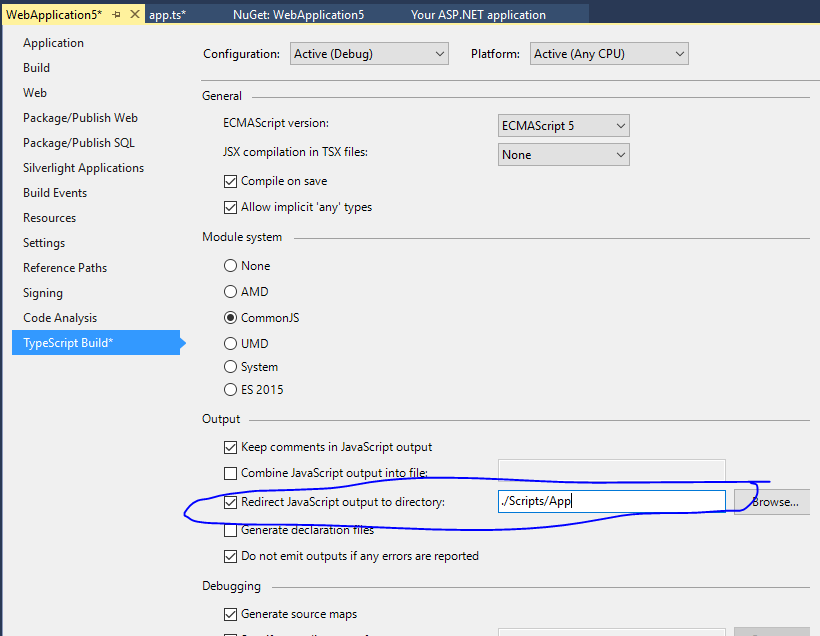

# ASP.NET 4

## Install TypeScript

If your version of Visual Studio does not already have TypeScript, you can install it for [Visual Studio 2015](http://www.microsoft.com/en-us/download/details.aspx?id=48593) or [Visual Studio 2013](https://www.microsoft.com/en-us/download/details.aspx?id=48739).
This quickstart uses Visual Studio 2015.

## Create a new project

1. Choose File
2. Choose New Project (Ctrl + Shift + N)
3. Choose Visual C#
4. Choose ASP.NET Web Application

    

5. Choose MVC

    I unchecked "Host in the cloud" since this will be a local demo.
    

Run the application and make sure that it works.

# Add TypeScript

The next step is to add a folder for TypeScript.


We'll just call it src.


## Add TypeScript code

Right click on src and click New Item.
Then choose TypeScript File and name the file app.ts.


## Add example code

Type the following code into app.ts.

```ts
function sayHello() {
    const compiler = (document.getElementById("compiler") as HTMLInputElement).value;
    const framework = (document.getElementById("framework") as HTMLInputElement).value;
    return `Hello from ${compiler} and ${framework}!`;
}
```

## Set up the build

Right-click on the project node and click Properties.
Then choose the TypeScript Build tab.
Check "Redirect JavaScript output to directory" and give the value: `./Scripts/App`.



## Call the script from a view

1. In the Solution Explorer, open Views | Home | Index.cshtml.

    

2. Change the code to be the following:

```html
@{
    ViewBag.Title = "Home Page";
}
<script src="~/Scripts/App/app.js"></script>
<div id="message"></div>
<div>
    Compiler: <input id="compiler" value="TypeScript" onkeyup="document.getElementById('message').innerText = sayHello()" /><br />
    Framework: <input id="framework" value="ASP.NET" onkeyup="document.getElementById('message').innerText = sayHello()" />
</div>
```

## Test

1. Run the project.
2. You should see a message when you type in the input boxes:


## Debug

1. In Edge, press F12 and click the Debugger tab.
2. Look in the first localhost folder, then src/app.ts
3. Put a breakpoint on the line with `return`.
4. Type in the boxes and confirm that the breakpoint hits in TypeScript code and that inspection works correctly.


That's all you need to know to include basic TypeScript in your ASP.NET project.
Next we'll include Angular and write a simple Angular app.

# Add Angular 2

## Download packages from NPM

1. Install [PackageInstaller](https://github.com/madskristensen/PackageInstaller).

2. Use PackageInstaller to install Angular 2 and systemjs.

    
    

## Enable decorator support

TypeScript's support for decorators is still experimental, so you'll need to manually edit the csproj to enable it.
To do this, edit the project by right-clicking 'Unload' and then 'Edit csproj'.
Then add the following code inside the `PropertyGroup` that contains TypeScript build settings (`TypeScriptTarget`, etc) after the last line (`<TypeScriptSourceRoot />`):

```xml
<TypeScriptExperimentalDecorators>True</TypeScriptExperimentalDecorators>
```

The resulting PropertyGroup should look like this:

```xml
  <PropertyGroup>
    <TypeScriptTarget>ES5</TypeScriptTarget>
    <TypeScriptJSXEmit>None</TypeScriptJSXEmit>
    <TypeScriptCompileOnSaveEnabled>True</TypeScriptCompileOnSaveEnabled>
    <TypeScriptNoImplicitAny>False</TypeScriptNoImplicitAny>
    <TypeScriptModuleKind>CommonJS</TypeScriptModuleKind>
    <TypeScriptRemoveComments>False</TypeScriptRemoveComments>
    <TypeScriptOutFile />
    <TypeScriptOutDir>./Scripts/App</TypeScriptOutDir>
    <TypeScriptGeneratesDeclarations>False</TypeScriptGeneratesDeclarations>
    <TypeScriptNoEmitOnError>True</TypeScriptNoEmitOnError>
    <TypeScriptSourceMap>True</TypeScriptSourceMap>
    <TypeScriptMapRoot />
    <TypeScriptSourceRoot />
    <TypeScriptExperimentalDecorators>True</TypeScriptExperimentalDecorators>
  </PropertyGroup>
```

The last line of the PropertyGroup is new.

## Add a CopyFiles target to the build

After the TypeScript configuration PropertyGroup, add a new ItemGroup and Target to copy the angular files.

```xml
<ItemGroup>
  <NodeLib Include="$(MSBuildProjectDirectory)\node_modules\angular2\bundles\angular2.js"/>
  <NodeLib Include="$(MSBuildProjectDirectory)\node_modules\angular2\bundles\angular2-polyfills.js"/>
  <NodeLib Include="$(MSBuildProjectDirectory)\node_modules\systemjs\dist\system.src.js"/>
  <NodeLib Include="$(MSBuildProjectDirectory)\node_modules\rxjs\bundles\Rx.js"/>
</ItemGroup>
<Target Name="CopyFiles" BeforeTargets="Build">
  <Copy SourceFiles="@(NodeLib)" DestinationFolder="$(MSBuildProjectDirectory)\Scripts"/>
</Target>
```

Now right-click on the project and reload it.
You should now see node_modules in the Solution Explorer.

## Write a simple Angular app in TypeScript

First, change the code in `app.ts` to:

```ts
///<reference path="../node_modules/angular2/typings/browser.d.ts"/>
import {Component} from "angular2/core"
import {bootstrap} from "angular2/platform/browser"
import {MyModel} from "./model"

@Component({
    selector: `my-app`,
    template: `<div>Hello from {{getCompiler()}}</div>`
})
class MyApp {
    model = new MyModel();
    getCompiler() {
        return this.model.compiler;
    }
}

bootstrap(MyApp);
```

Then add another TypeScript file in `src` named `model.ts`:

```ts
///<reference path="../node_modules/angular2/typings/browser.d.ts"/>
export class MyModel {
    compiler = "TypeScript";
}
```

This code creates a tiny Angular 2 app.
Note that the [triple-slash references](Triple-Slash Directives.md) are a workaround for [RxJS issue #1270](https://github.com/ReactiveX/RxJS/issues/1270) that is only needed until Angular 2 upgrades to RxJS beta.2.

Finally, change the code in `Views/Home/Index.cshtml` to the following:

```html
@{
    ViewBag.Title = "Home Page";
}
<script src="~/Scripts/angular2-polyfills.js"></script>
<script src="~/Scripts/system.src.js"></script>
<script src="~/Scripts/rx.js"></script>
<script src="~/Scripts/angular2.js"></script>
<script>
    System.config({
        packages: {
            '/Scripts/App': {
                format: 'cjs',
                defaultExtension: 'js'
            }
        }
    });
    System.import('/Scripts/App/app').then(null, console.error.bind(console));
</script>
<my-app>Loading...</my-app>
```

This loads the app.
When you run the ASP.NET application you should see a div that says "Loading..." and then updates to say "Hello from TypeScript".
